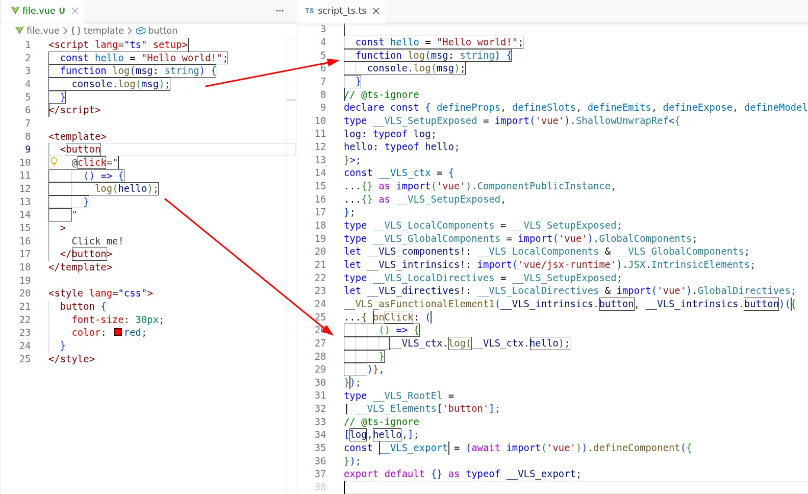
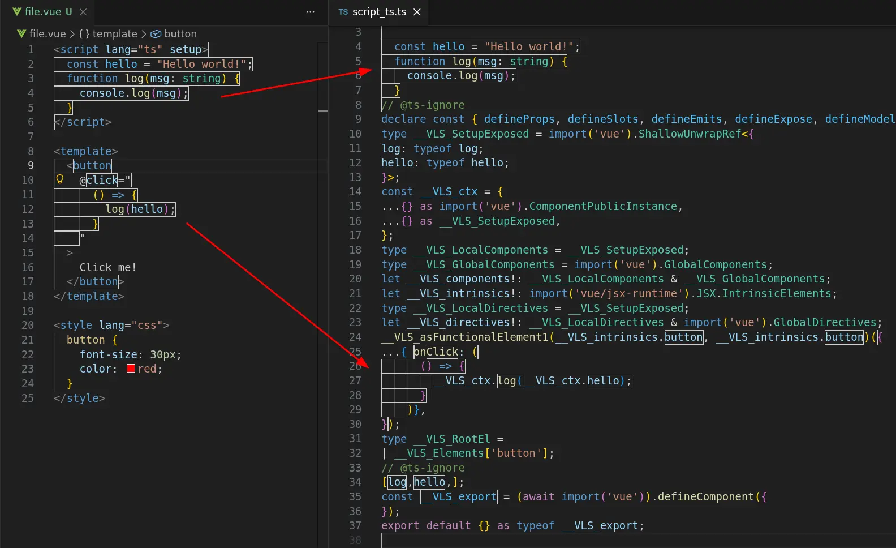

---
authors:
  name: auvred
  title: Maintainer
  picture: /team/auvred.webp
  url: https://github.com/auvred
date: 2026-03-24
description: Learn how Flint uses Volar.js for type-aware linting in Astro, Svelte, and Vue.
excerpt:
  Traditional approaches to linting TypeScript-based languages have had significant drawbacks for many years.
  They're often difficult to configure and come with limitations that prevent rules from fully understanding the types of code.
  Flint introduces a comprehensive Volar.js-based architecture that enables fully type-aware lint rules for languages like Astro, Svelte, and Vue.
  Learn how Flint's architecture solves this once and for all!
title: Fully Type-Aware Linting for Astro, Svelte, and Vue
---

We're excited to say that Flint is the first modern linter with full support for typed linting on extension languages.
Flint uses Volar.js to integrate TypeScript with extension languages, giving lint rules access to full type information even in embedded JavaScript expressions within language-specific files.
This represents a big leap forward in linting for these languages.

In this post, we'd like to share with you what it means to support "extension" languages, why Flint chose Volar.js, and what that means for lint rules.
We think by the end of it you'll see why we're so excited about these advances in typed linting for the broader TypeScript ecosystem.

## What are TypeScript-based languages?

Frontend frameworks often introduce their own languages that extend basic TypeScript syntax with custom features.
JSX-based frameworks like React and Solid.js natively work with the TypeScript compiler's `.jsx` and `.tsx` file support.
But more extensive frameworks like Astro, Svelte, and Vue that add language-specific additions and non-standard file extensions need more tooling to work well with TypeScript.

Traditional linters such as ESLint have been able to work with those languages on a _syntax-only_ level.
They can use the languages' provided parsers to get an AST for the languages' contents and report errors purely based on that AST.

However, syntax-only linting is often not enough to catch all bugs.
[Type-aware linting](https://typescript-eslint.io/blog/typed-linting) allows for significantly more powerful lint rules -- but requires more deep integrations with TypeScript tooling.

Flint's goals include providing a complete linting experience out-of-the-box.
That includes full typed linting without any additional configuration file settings.
To provide this for users, we needed to finally solve long-standing questions around how to fully lint extension languages and their embedded code with TypeScript.

### Typed Rules and Embedded JavaScript Expressions

The root problem with typed linting extension languages is that files with custom extensions aren't supported by TypeScript natively.
Attempting to resolve types that imports from those custom files does not work with TypeScript out-of-the-box.
All imports from [`.astro`](https://github.com/ota-meshi/eslint-plugin-astro/issues/348), [`.svelte`](https://github.com/sveltejs/eslint-plugin-svelte/issues/1150), or [`.vue`](https://github.com/vuejs/vue-eslint-parser/issues/104) files are resolved to `any` when files are parsed using `@typescript-eslint/parser`.
This causes issues with virtually all type-aware rules; users of typed linting most frequently experience these as a large number of false reports from the `@typescript-eslint/no-unsafe-*` family of rules.

:::note
[Yosuke Ota](https://github.com/ota-meshi)'s [`typescript-eslint-parser-for-extra-files`](https://github.com/ota-meshi/typescript-eslint-parser-for-extra-files) made progress on providing type information on TypeScript-based language files in ESLint.
See the library's documentation for more issues and excellent prior art.
:::

Another major user-facing problem is that embedded JavaScript expressions in extension languages can't be linted with type information.
TypeScript cannot natively type-check syntax outside of JavaScript, JSX, or TypeScript.
For example, traditional linters would not be able to use TypeScript to determine type information in the following Vue snippet to know whether the `log(hello);` call is safe.

:::note
Vue is used in illustrations and examples throughout this post, but similar logic and rules apply for all other TypeScript-based languages.
:::

```vue {11-13} /(?<!console.)log/ "hello"
<script lang="ts" setup>
	function log(msg: string) {
		console.log(msg);
	}
	const hello = "Hello world!";
</script>

<template>
	<button
		@click="
			() => {
				log(hello);
			}
		"
	>
		Click me!
	</button>
</template>
```

Notice how the `@click` event listener is a JavaScript expression that uses variables declared in `<script>`.
In order to lint this JavaScript expression properly, we need the ability to resolve the types used inside it.

Resolving types in extension languages is a difficult technical challenge.
It's unfortunately not solvable by straightforward techniques like concatenating all JavaScript expressions into one big file.
Embedded JavaScript expressions often rely on many language-specific quirks that must be taken into account.

Take, for example, the following code that uses a custom Vue component:

```vue "data"
<template>
	<MyComponent v-slot="{ data }">
		{{ data.text }}
	</MyComponent>
</template>
```

`data` comes from `MyComponent`'s `v-slot`.
To know its type, we must resolve the type of `MyComponent`, extract its `v-slot` type, and resolve its type based on Vue-specific logic.

### Type Checking TypeScript-Based Extension Languages

At some point, every TypeScript-based-language author wants to enable type-checking for their language.
There are two main difficulties here:

1. Getting TypeScript to perform type-checking of syntax it's unaware of (so they do not get skipped or throw errors)
2. Resolving custom file extensions in TypeScript's existing module resolution system (so they are not resolved to `any`)

Even though TypeScript can be extended with [Language Service Plugins](https://github.com/microsoft/TypeScript/wiki/Writing-a-Language-Service-Plugin), these plugins can't add new custom syntax to TypeScript.
Moreover, plugins extend the _editing experience only_, i.e., they can't be used in CLI workflows, such as `tsc --noEmit`.

That's why TypeScript-based-language authors often have to resort to workarounds that force TypeScript into understanding their custom languages.

Several different approaches to this problem exist.
For example, [`svelte-check`](https://github.com/sveltejs/language-tools/tree/master/packages/svelte-check) and [`ngtsc`](https://github.com/angular/angular/tree/main/packages/compiler-cli/src/ngtsc) both use TypeScript compiler to type-check custom syntax.
However, they use drastically different approaches: svelte-check adapts TypeScript Language Service to look at one translated component at a time, whereas ngtsc extends the compilation itself with framework-generated checking code and then asks TypeScript to analyze that larger synthetic program.
Unifying those two and potentially other embedded languages' TypeScript compiler workarounds into a single linting architecture would be difficult and unsustainable.

Thankfully, there is a tool that can provide unified type-checking for custom languages.

## Volar.js

[Volar.js](https://volarjs.dev), the "Embedded Language Tooling Framework", is a framework that provides language authors with a high-level scaffolding that handles all the complexities of language tooling.
It handles things such as LSP integration, routing of LSP requests to the appropriate embedded language service, type-checking powered by TypeScript, and much more -- so that authors can avoid each reimplementing those areas of tooling.

Volar.js originally started as part of the Vue Language Tools initiative.
[Johnson Chu](https://github.com/johnsoncodehk/) developed outstanding language support for Vue.js, and then they noticed the pattern that could be decoupled from Vue Language Tools to support almost any possible TypeScript-based language.
Johnson generously extracted out Volar.js to help other language authors.

### Embedded Languages Support

A key benefit of using Volar.js is its full support for various forms of embedded languages.
It allows language tooling authors to define various forms of embedded syntax, as well as how types flow through that syntax.

The following code block shows an archetypal Vue Single File Component (SFC).
It contains three different embedded languages: TypeScript (`<script lang="ts">`), HTML (`<template>`), and CSS (`<style lang="css">`).
The HTML block also has an embedded TypeScript/JavaScript expression inside it.

```vue
<script lang="ts" setup>
	// TypeScript code...
</script>

<template>
	<button
		@click="
			() => {
				/* TypeScript code... */
			}
		"
	>
		<!-- HTML code... -->
	</button>
</template>

<style lang="css">
	/* CSS code... */
</style>
```

Vue Language Tools use Volar.js to define how to map between those areas of syntax.
It knows how bindings declared in the `<script>` block become available inside template expressions such as `@click`, and how those embedded expressions map back to the original `.vue` file for type checking and diagnostics.

We're particularly interested in Volar.js' type-checking abilities.

It allows language authors to create "language plugins" which serve two important purposes:

- They describe custom file extensions
- They translate custom language syntax into pure TypeScript code that can be type-checked by the TypeScript compiler

### How Volar.js Works

:::tip
Volar.js ships a nice VS Code extension called [Volar Labs](https://volarjs.dev/core-concepts/volar-labs/).
It's helpful in showing how custom syntax is translated into TypeScript code.
:::

Here's a screenshot showing a `file.vue` source file on the left, compared to the generated `script_ts.ts` equivalent on the right.
All of `file.vue`'s embedded JavaScript expressions, including code from its `<script>` block, are merged into that single TypeScript file.

<div class="only-light">



</div>

<div class="only-dark">



</div>

Transforming the file in this way allows its variables to be fully type-checkable.
For example, variables declared in `<script setup>` are prefixed with `__VLS_ctx.` when used in `<template>`.
Thanks to this, the type of every identifier used in the `@click` handler can be resolved to its actual value in tooling such as type-aware linting.

This is how [`vue-tsc`](https://github.com/vuejs/language-tools/tree/94907be4f056f25867e46a117ab18d2782b425d7/packages/tsc) type-checks `.vue` files internally!

### Prior Art

[Johnson Chu](https://github.com/johnsoncodehk)'s [`tsslint`](https://github.com/johnsoncodehk/tsslint) ("The lightest TypeScript semantic linting solution in JS") used Volar.js to solve the problem of type-aware linting for TypeScript-based languages.
Thanks to Volar.js language plugins, it achieved linting support for Astro, MDX, Vue, and Vue Vine.
In doing so, `tsslint` solved one of the gaps in typed linting: linting extension language files on their own.

Flint builds on `tsslint`'s feature set by additionally solving the first problem of `any`-typed imports from extension language files.
Flint includes a dynamic TypeScript patching mechanism required to resolve custom file extensions to concrete types instead of `any`.
It also exposes custom language ASTs to lint rules, which allows lint rules to fully operate on both native TypeScript files as well as extension language files.

## Using Volar.js for Type-Aware Linting

Flint's `@flint.fyi/volar-language` package allows creating TypeScript-based languages with full typed linting support.
In order to add support for a new language, a plugin author must provide:

- A list of custom file extensions
- Volar.js language plugin
- Optional extra properties that are passed to the rule context

Now, let's explore how this works from a user's perspective.

### Initialization

Flint Volar-based languages are able to register themselves with Flint implicitly: users' configurations don't have to wrangle any extra settings to work with the languages.
Importing from a language package is enough to get Flint ready to lint the language's extension syntax.

Take a look at this Flint config structure that imports Flint's Vue language:

```typescript 'import { vue } from "@flint.fyi/vue"'
// flint.config.ts
import { defineConfig } from "flint";
import { vue } from "@flint.fyi/vue";

export default defineConfig({
	// ...
});
```

By importing `@flint.fyi/vue`, you enable _all TypeScript-only rules_ to support `.vue` linting.
No additional configuration needed!

### Lint Rules

All Flint Volar.js-based rules can lint `.ts` files as well.

Rule authors can distinguish between `.ts` and `.vue` files by the presence of the `services.vue` property.

For `.vue` files, `services.vue` provides the Vue SFC AST as well as other handy items.

```typescript /services.vue(?= )/ "sfc"
ruleCreator.createRule(vueLanguage, {
	setup(context) {
		return {
			visitors: {
				SourceFile(node, services) {
					if (services.vue == null) {
						// we're linting .ts file
					} else {
						const { sfc } = services.vue;
						// we're linting .vue file
					}
				},
			},
		};
	},
});
```

Since the Vue language in Flint is a superset of the TypeScript language, lint rule authors can use both Vue and TypeScript ASTs in order to perform type-aware linting of Vue `<template>`s!

Another benefit of the TypeScript language being a strict subset of the Vue language is that all TypeScript-only lint rules can work on all JavaScript expressions in `.vue` files even if they weren't intended to work there.

To sum up, both Vue and TypeScript files are linted as if they were TypeScript files.
However, when rules are run on Vue files, they can optionally access the original Vue file AST, the original source text of the `.vue` file, and so on.

## Flint in Action

Let's explore how all of this works!

We have the following project layout:

```
package.json
flint.config.ts
src/
	index.ts
	MyComponent.vue
```

Now, let's look at `flint.config.ts`:

```typescript "ts.files.all, vue.files.all" {11-17}
// flint.config.ts

import { defineConfig, ts } from "flint";
import { vue } from "@flint.fyi/vue";

export default defineConfig({
	use: [
		{
			files: [ts.files.all, vue.files.all],
			rules: [
				ts.rules({
					anyReturns: true,
					anyCalls: true,
				}),
				vue.rules({
					vForKeys: true,
				}),
			],
		},
	],
});
```

Note how the `ts` and `vue` languages coexist in the config without any cross-language configuration.

We configure both Vue and TypeScript rules to run on `**/*.ts` and `**/*.vue` files.

Next, let's look at `src/index.ts`:

```typescript "return MyComponent" "return anyValue"
// src/index.ts

import MyComponent from "./MyComponent.vue";

function vueComponent() {
	return MyComponent;
}

declare const anyValue: any;
function any() {
	return anyValue;
}
```

Here, we're interested in the results produced by the [`ts/anyReturns`](/rules/ts/anyreturns) rule.
It reports `return X` statements where the type of `X` is `any`.

In this file, we have two possible candidates for a report.

1. `return MyComponent` -- returns a Vue component.
This line is reported by ESLint unless you use `typescript-eslint-parser-for-extra-files`.
However, we would like Flint not to report it, since this is a legitimate usage.
2. `return anyValue` -- returns `any`-typed value.
This is unsafe, so we would like this return statement to be reported.

Let's proceed to `src/MyComponent.vue`:

```vue "anyFunction()" 'v-for="i in 3"'
// src/MyComponent.vue

<script lang="ts" setup>
	declare const anyFunction: any;
</script>

<template>
	<button
		@click="
			() => {
				anyFunction();
			}
		"
	>
		Click me!
	</button>

	<div v-for="i in 3"></div>
</template>
```

Here, we're calling `anyFunction` whose type is `any`; we want [`ts/anyCalls`](/rules/ts/anycalls) rule to catch this unsafe behavior.
Notice how this function is called from the JavaScript expression embedded in the `<template>`.
Traditional linters are unable to catch this.

In addition, we introduced `<div v-for="i in 3"></div>`, which lacks a `:key` directive.
This is unsafe, so we would like Flint to report it as well.

And finally, let's run Flint:

```ansi
> npx flint --presenter detailed

Linting with flint.config.ts...
╭./src/index.ts
│ 
│ [ts/anyReturns] Unsafe return of a value of type `any`.
│ 
│ 6:18 │ function any() { return anyValue }
│      │                  ~~~~~~~~~~~~~~~
│ 
│  Returning a value of type `any` or a similar unsafe type
│  defeats TypeScript's type safety guarantees.
│  This can allow unexpected types to propagate through your codebase,
│  potentially causing runtime errors.
│ 
│  Suggestion: Ensure the returned value has a well-defined, specific type.
│ 
│  → flint.fyi/rules/ts/anyreturns
│ 
╰──────────────────────────────────────────────────────────────────────────
╭./src/MyComponent.vue
│ 
│ [ts/anyCalls] Unsafe call of `any` typed value.
│ 
│ 6:27 │ <button @click="() => { anyFunction() }">Click me!</button>
│      │                         ~~~~~~~~~~~
│ 
│  Calling a value typed as `any` or `Function` bypasses TypeScript's type checking.
│  TypeScript cannot verify that the value is actually a function,
│  what parameters it expects, or what it returns.
│ 
│  Suggestion: Ensure the called value has a well-defined function type.
│ 
│  → flint.fyi/rules/ts/anycalls
│ 
│ [ts/vForKeys] Elements using v-for must include a unique :key
│               to ensure correct reactivity and DOM stability.
│ 
│  8:8 │ <div v-for="i in 3"></div>
│      │      ~~~~~
│ 
│  A missing :key can cause unpredictable updates during rendering optimizations.
│  Without a key, Vue may reuse or reorder elements incorrectly,
│  which breaks expected behavior in transitions and stateful components.
│ 
│  Suggestion: Always provide a unique :key based on the v-for item, such as an id.
│ 
│  → flint.fyi/rules/vue/vforkeys
│ 
╰──────────────────────────────────────────────────────────────────────────

✖ Found 3 reports across 2 files.
```

Cool! What do we have here:

1. `function vueComponent() { return MyComponent }` is not reported!
   The type of the `MyComponent` identifier is resolved to a valid Vue component type.
It's no longer an `any`.
2. `function any() { return anyValue }` is reported by [`ts/anyReturns`](/rules/ts/anyreturns).
This shows us that `return MyComponent` wasn't reported not because the rule is broken.
In fact, it's functioning as expected, reporting all `any`-typed values returned from functions.
3. `@click="() => { anyFunction() }"` in Vue `<template>` is reported by the [`ts/anyCalls`](/rules/ts/anycalls) rule.
We can see that the TypeScript-only rule works in JavaScript expressions embedded in Vue templates just fine!
4. `<div v-for="i in 3"></div>` is reported by `vue/vForKeys`.
Vue rules can access the Vue AST and analyze it.

## What's Next

Flint is still in its early pre-alpha stages.
We're excited to show off this early technical preview of the novel architecture we're building into the linter.

The next steps for Flint's languages support are:

- Implement all Astro, Svelte, and Vue rules in their Flint plugins
- Investigate support for other TypeScript-based languages such as Ember and MDX

If you're wondering what Flint's broader roadmap looks like, when you'll be able to try more of this out, or why some of it isn't available yet, that's coming next.
Our next blog post will dig into the project's timelines for this year and the next.

If you're interested in helping build out a new experimental linter, we'd love to have you join us.
At the very least, see [About](/about) for how to get started using Flint as a user.
Trying out the project and telling us about your experience on the [Flint Discord](https://flint.fyi/discord) would be immensely helpful.

The [GitHub issue tracker](https://github.com/flint-fyi/flint/issues) is where you can find our list of upcoming work.
See our [Contributing guide](https://github.com/flint-fyi/flint/blob/main/.github/CONTRIBUTING.md) for how to find issues that you can get started on.
Feel free to ask for help if you're new and unsure.
We're happy to assist you.

### Supporting Flint Financially

Flint can receive donations on its [Open Collective](https://opencollective.com/flintfyi).
Your financial support will allow us to pay our volunteer contributors and maintainers to tackle more Flint work.
As thanks, we'll put you under a sponsors list on the [flint.fyi homepage](/).

### Further Reading

See [What Flint Does Differently](/blog/what-flint-does-differently) for a large list of the other architectural decisions Flint is trying out.
